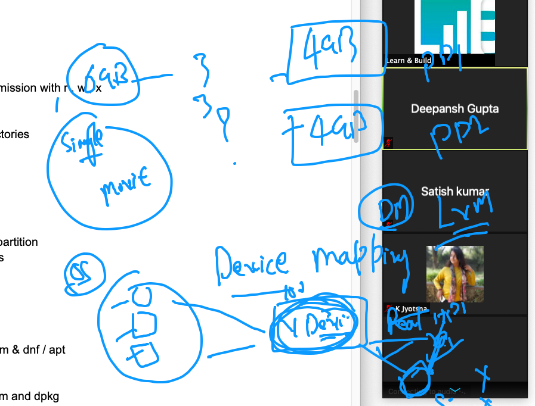
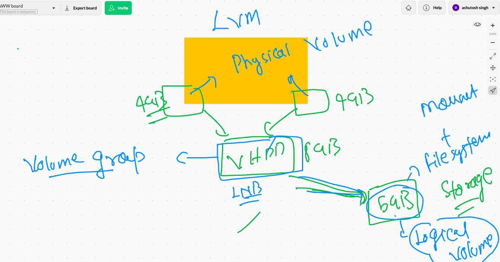
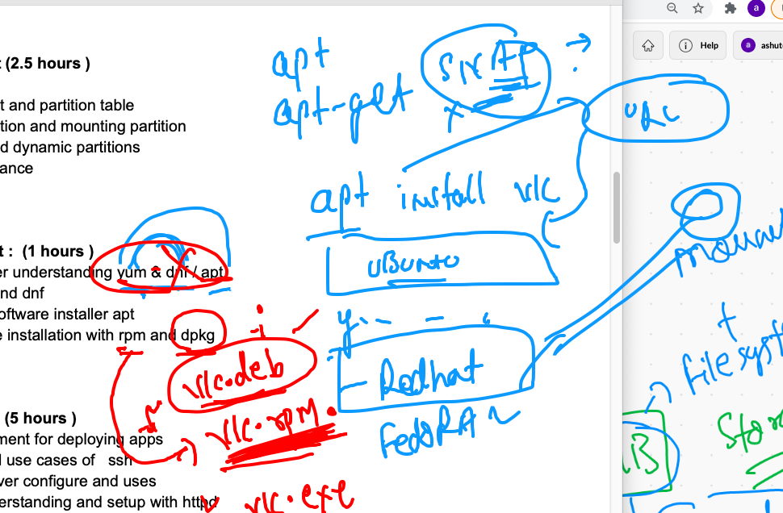
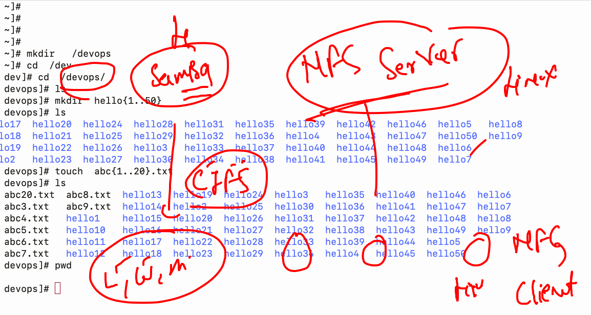
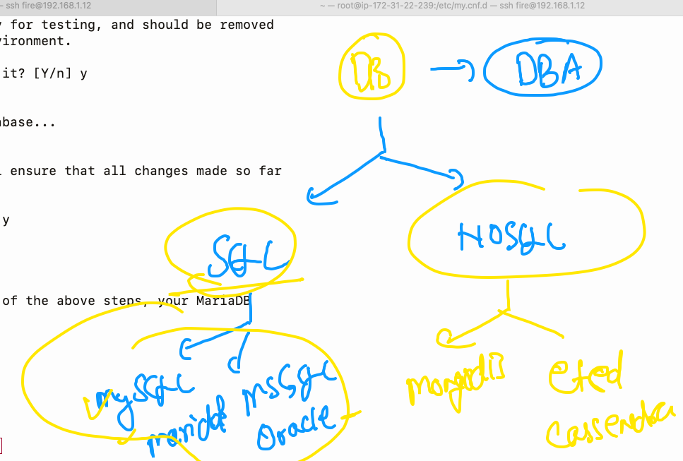
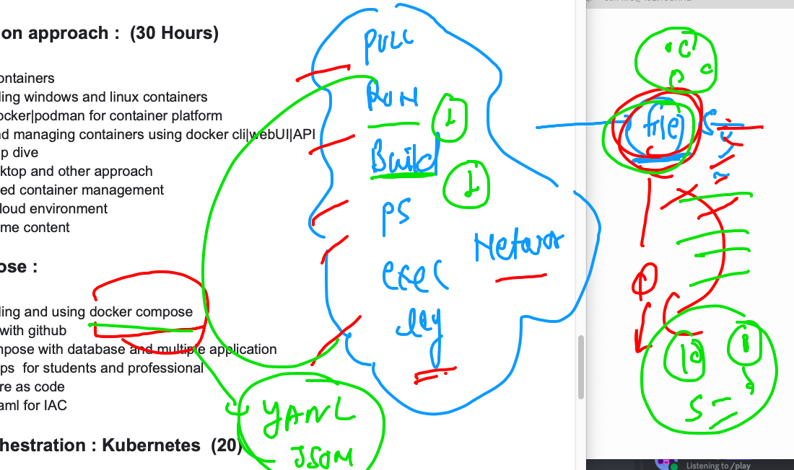
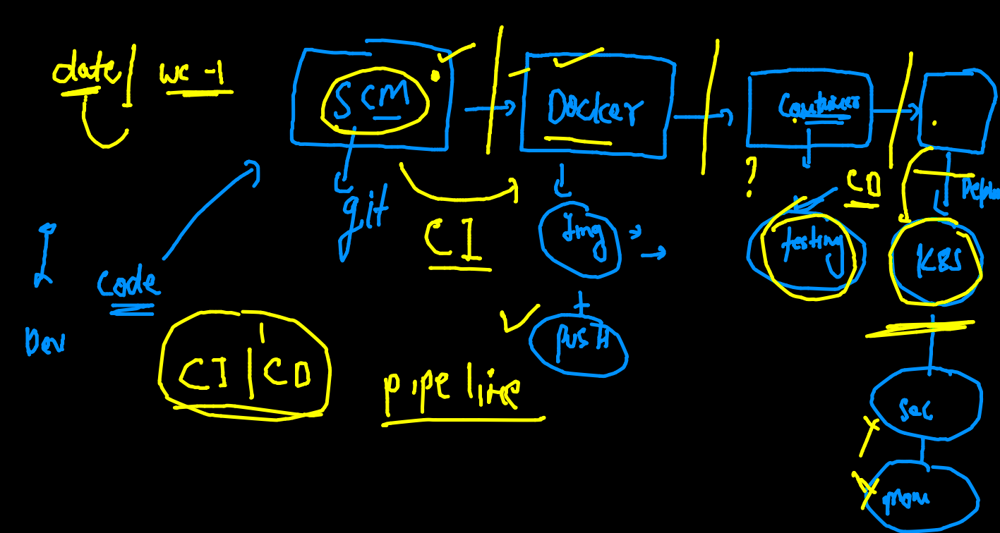

# data_engineering

## linux revision 

### IO redirection 

```
49  cal  >>mydata.txt 
   50  cat  mydata.txt 
   51  whoami >> mydata.txt 
   52  cat  mydata.txt 
   53  history 
   54  ksdjflsdf 
   55  ksdfjlsdfsd   >>mydata.txt 
   56  ksdfjlsdfsd   >error.txt 
   57  ls
   58  cat  error.txt 
   59  ksdfjlsdfsd   2>error.txt 
   60  cat  error.txt 
   61  date    2>error.txt 
   62  kkkk
   63  kkk    2>error.txt 
   64  cat  error.txt 
   65  kkk &>error.txt 
   66  date  &>error.txt 
   67  cat  error.txt 
   68  date  &>>error.txt 
   69  kkk  &>>error.txt 
   70  cat  error.txt 
   71  cal 
   72  cal   |   head  -2
   73  cal   |  tail   -2
   74  cal   |  tail  
   75  cal   |  head 
   76  history 
   77  echo hello 
   78  echo hello   |   tr  'a-z'  'A-Z'
   79  cat /etc/passwd
   80  cat /etc/passwd  |  tr 'a-z'  'A-Z'
   81  history 
   82  cat /etc/passwd  |  tr 'c-f'  'C-F'


```

## COncept of sudoers 


### checking Inode info about a file 

```
fire@XIA:~$ file  /etc/passwd
/etc/passwd: ASCII text
fire@XIA:~$ stat
stat       static-sh  
fire@XIA:~$ stat   /etc/passwd
  File: /etc/passwd
  Size: 3155      	Blocks: 8          IO Block: 4096   regular file
Device: 802h/2050d	Inode: 11548203    Links: 1
Access: (0644/-rw-r--r--)  Uid: (    0/    root)   Gid: (    0/    root)
Access: 2021-08-01 10:00:42.552227020 +0530
Modify: 2021-08-01 10:00:42.520227283 +0530
Change: 2021-08-01 10:00:42.520227283 +0530
 Birth: -
fire@XIA:~$ 
fire@XIA:~$ 
fire@XIA:~$ ls  -l  /etc/passwd
-rw-r--r-- 1 root root 3155 Aug  1 10:00 /etc/passwd
fire@XIA:~$ ls  -li   /etc/passwd
11548203 -rw-r--r-- 1 root root 3155 Aug  1 10:00 /etc/passwd


```

### Demo ACL 

```
root@XIA:~# vim /hello.txt
root@XIA:~# ls -l /hello.txt 
-rw-r--r-- 1 root root 10 Aug  1 10:11 /hello.txt
root@XIA:~# su - fire
fire@XIA:~$ vim /hello.txt 
fire@XIA:~$ 
fire@XIA:~$ 
fire@XIA:~$ logout
root@XIA:~# ls -l /hello.txt 
-rw-r--r-- 1 root root 10 Aug  1 10:11 /hello.txt
root@XIA:~# 
root@XIA:~# 
root@XIA:~# setfacl  -m  u:fire:rw-  /hello.txt 
root@XIA:~# su - fire
fire@XIA:~$ vim /hello.txt 
fire@XIA:~$ logout

```

## storage in any OS 


### checking hard disk / pd in any linux based OS 

```
[root@ip-172-31-22-53 ~]# lsblk 
NAME    MAJ:MIN RM  SIZE RO TYPE MOUNTPOINT
xvda    202:0    0   50G  0 disk 
└─xvda1 202:1    0   50G  0 part /
xvdf    202:80   0  100G  0 disk 
[root@ip-172-31-22-53 ~]# fdisk  -l
Disk /dev/xvda: 50 GiB, 53687091200 bytes, 104857600 sectors
Units: sectors of 1 * 512 = 512 bytes
Sector size (logical/physical): 512 bytes / 512 bytes
I/O size (minimum/optimal): 512 bytes / 512 bytes
Disklabel type: gpt
Disk identifier: C52DB3B7-097C-4067-908A-ED8095F37B2E

Device       Start       End   Sectors Size Type
/dev/xvda1    4096 104857566 104853471  50G Linux filesystem
/dev/xvda128  2048      4095      2048   1M BIOS boot

Partition table entries are not in disk order.


Disk /dev/xvdf: 100 GiB, 107374182400 bytes, 209715200 sectors
Units: sectors of 1 * 512 = 512 bytes
Sector size (logical/physical): 512 bytes / 512 bytes


```

### formating / making a filesystem of a storage 

```
[root@ip-172-31-22-53 ~]# mkfs.
mkfs.cramfs  mkfs.ext2    mkfs.ext3    mkfs.ext4    mkfs.fat     mkfs.minix   mkfs.msdos   mkfs.vfat    mkfs.xfs
[root@ip-172-31-22-53 ~]# mkfs.xfs   /dev/xvdf 
meta-data=/dev/xvdf              isize=512    agcount=4, agsize=6553600 blks
         =                       sectsz=512   attr=2, projid32bit=1
         =                       crc=1        finobt=1, sparse=0
data     =                       bsize=4096   blocks=26214400, imaxpct=25
         =                       sunit=0      swidth=0 blks
naming   =version 2              bsize=4096   ascii-ci=0 ftype=1
log      =internal log           bsize=4096   blocks=12800, version=2
         =                       sectsz=512   sunit=0 blks, lazy-count=1
realtime =none                   extsz=4096   blocks=0, rtextents=0


```

### mounting in linux and unmount also 

```
[root@ip-172-31-22-53 ~]# mount  /dev/xvdf     /mnt/ashu/
[root@ip-172-31-22-53 ~]# cd  /mnt/ashu/
[root@ip-172-31-22-53 ashu]# ls
[root@ip-172-31-22-53 ashu]# mkdir  hello guys 
[root@ip-172-31-22-53 ashu]# ls
guys  hello
[root@ip-172-31-22-53 ashu]# echo hlloo   >a.txt
[root@ip-172-31-22-53 ashu]# ls
a.txt  guys  hello
[root@ip-172-31-22-53 ashu]# cd
[root@ip-172-31-22-53 ~]# 
[root@ip-172-31-22-53 ~]# ls  /mnt/ashu/
a.txt  guys  hello
[root@ip-172-31-22-53 ~]# umount  /dev/xvdf  
[root@ip-172-31-22-53 ~]# cd  /mnt/ashu/
[root@ip-172-31-22-53 ashu]# ls
[root@ip-172-31-22-53 ashu]# cd
[root@ip-172-31-22-53 ~]# 
[root@ip-172-31-22-53 ~]# mkdir   /hii
[root@ip-172-31-22-53 ~]# mount  /dev/xvdf     /hii 
[root@ip-172-31-22-53 ~]# ls  /mnt/ashu/
[root@ip-172-31-22-53 ~]# ls  /hii
a.txt  guys  hello
[root@ip-172-31-22-53 ~]# 


```

### fstab in linux 

```
[root@ip-172-31-22-53 ~]# cat  /etc/fstab 
#

UUID=04b92f2f-4366-4687-868b-7c403cc59901     /           xfs    defaults,noatime  1   1
/dev/xvdf  /Cdrive/  xfs   defaults  0   0 

```

### Device mapper 




## LVM show 



### creating pv

```
[root@ip-172-31-22-53 ~]# pvcreate   /dev/xvdg   /dev/xvdh  
  Physical volume "/dev/xvdg" successfully created.
  Physical volume "/dev/xvdh" successfully created.
  
```

### creating Vg 

```
[root@ip-172-31-22-53 ~]# vgcreate   LnB  /dev/xvdg  /dev/xvdh  
  Volume group "LnB" successfully created
[root@ip-172-31-22-53 ~]# vgdisplay 
  --- Volume group ---
  VG Name               LnB
  System ID             
  Format                lvm2
  Metadata Areas        2
  Metadata Sequence No  1
  VG Access             read/write
  VG Status             resizable
  MAX LV                0
  Cur LV                0
  Open LV               0
  Max PV                0
  Cur PV                2
  Act PV                2
  VG Size               7.99 GiB
  PE Size               4.00 MiB
  Total PE              2046
  Alloc PE / Size       0 / 0   
  Free  PE / Size       2046 / 7.99 GiB
  VG UUID               NK6n98-GHo2-kWSR-DqYr-P3Og-TQvI-rEWAgR
   
```

### creating lv

```
[root@ip-172-31-22-53 ~]# lvcreate   --name  mydisk --size  6000M  LnB 
  Logical volume "mydisk" created.
[root@ip-172-31-22-53 ~]# lvdisplay 
  --- Logical volume ---
  LV Path                /dev/LnB/mydisk
  LV Name                mydisk
  VG Name                LnB
  LV UUID                OmiMPi-Qp5u-a6PQ-jgFR-HQy0-6hUE-wpMKzM
  LV Write Access        read/write
  LV Creation host, time ip-172-31-22-53.ec2.internal, 2021-08-01 05:58:41 +0000
  LV Status              available
  # open                 0
  LV Size                <5.86 GiB
  Current LE             1500
  Segments               2
  Allocation             inherit
  Read ahead sectors     auto
  - currently set to     256


```

### increasing size 

```
[root@ip-172-31-22-53 ~]# lvextend  --size  +800M    /dev/LnB/mydisk
  Size of logical volume LnB/mydisk changed from <5.86 GiB (1500 extents) to 6.64 GiB (1700 extents).
  Logical volume LnB/mydisk successfully resized.
[root@ip-172-31-22-53 ~]# xfs_growfs   /dev/LnB/mydisk
meta-data=/dev/mapper/LnB-mydisk isize=512    agcount=4, agsize=384000 blks
         =                       sectsz=512   attr=2, projid32bit=1
         =                       crc=1        finobt=1 spinodes=0
data     =                       bsize=4096   blocks=1536000, imaxpct=25
         =                       sunit=0      swidth=0 blks
naming   =version 2              bsize=4096   ascii-ci=0 ftype=1
log      =internal               bsize=4096   blocks=2560, version=2
         =                       sectsz=512   sunit=0 blks, lazy-count=1
realtime =none                   extsz=4096   blocks=0, rtextents=0
data blocks changed from 1536000 to 1740800
[root@ip-172-31-22-53 ~]# lvdisplay 
  --- Logical volume ---
  LV Path                /dev/LnB/mydisk
  LV Name                mydisk
  VG Name                LnB
  LV UUID                OmiMPi-Qp5u-a6PQ-jgFR-HQy0-6hUE-wpMKzM
  LV Write Access        read/write
  LV Creation host, time ip-172-31-22-53.ec2.internal, 2021-08-01 05:58:41 +0000
  LV Status              available
  # open                 1
  LV Size                6.64 GiB
  Current LE             1700
  Segments               2
  Allocation             inherit
  Read ahead sectors     auto
  - currently set to     256
  Block device           253:0


```

### Software installation in Linux flavours 



### NFS 



### SErver side steps 

```
[root@ip-172-31-22-53 devops]# yum  install  nfs-utils  
Loaded plugins: extras_suggestions, langpacks, priorities, update-motd
amzn2-core                                                                                               | 3.7 kB  00:00:00     
Package 1:nfs-utils-1.3.0-0.54.amzn2.0.2.x86_64 already installed and latest version
Nothing to do
[root@ip-172-31-22-53 devops]# 
[root@ip-172-31-22-53 devops]# 
[root@ip-172-31-22-53 devops]# 
[root@ip-172-31-22-53 devops]# vim   /etc/exports  
[root@ip-172-31-22-53 devops]# cat /etc/exports
/devops     172.31.22.239(ro)

```

### adding in sserver side 

```
[root@ip-172-31-22-53 devops]# systemctl restart nfs-server
[root@ip-172-31-22-53 devops]# systemctl status  nfs-server
● nfs-server.service - NFS server and services
   Loaded: loaded (/usr/lib/systemd/system/nfs-server.service; disabled; vendor preset: disabled)
   Active: active (exited) since Sun 2021-08-01 06:47:30 UTC; 7s ago
  Process: 4068 ExecStart=/usr/sbin/rpc.nfsd $RPCNFSDARGS (code=exited, status=0/SUCCESS)
  Process: 4063 ExecStartPre=/bin/sh -c /bin/kill -HUP `cat /run/gssproxy.pid` (code=exited, status=0/SUCCESS)
  Process: 4062 ExecStartPre=/usr/sbin/exportfs -r (code=exited, status=0/SUCCESS)
 Main PID: 4068 (code=exited, status=0/SUCCESS)
   CGroup: /system.slice/nfs-server.service

Aug 01 06:47:30 ip-172-31-22-53.ec2.internal systemd[1]: Starting NFS server and services...
Aug 01 06:47:30 ip-172-31-22-53.ec2.internal systemd[1]: Started NFS server and services.
[root@ip-172-31-22-53 devops]# 
[root@ip-172-31-22-53 devops]# 
[root@ip-172-31-22-53 devops]# 
[root@ip-172-31-22-53 devops]# exportfs  -r
[root@ip-172-31-22-53 devops]# 
[root@ip-172-31-22-53 devops]# 
[root@ip-172-31-22-53 devops]# 
[root@ip-172-31-22-53 devops]# exportfs  -r
[root@ip-172-31-22-53 devops]# exportfs  -v
/devops       	172.31.22.239(ro,sync,wdelay,hide,no_subtree_check,sec=sys,secure,root_squash,no_all_squash)
[root@ip-172-31-22-53 devops]# 

```


### NFs client 

```

[root@ip-172-31-22-239 ~]# yum install nfs-utils -y
Loaded plugins: extras_suggestions, langpacks, priorities, update-motd
amzn2-core                                                                                           | 3.7 kB  00:00:00     
Package 1:nfs-utils-1.3.0-0.54.amzn2.0.2.x86_64 already installed and latest version
Nothing to do


--

[root@ip-172-31-22-239 ~]# mkdir  /mnt/server
[root@ip-172-31-22-239 ~]# 
[root@ip-172-31-22-239 ~]# 
[root@ip-172-31-22-239 ~]# ls  /mnt/server/
[root@ip-172-31-22-239 ~]# 
[root@ip-172-31-22-239 ~]# 
[root@ip-172-31-22-239 ~]# mount   172.31.22.53:/devops  /mnt/server/
[root@ip-172-31-22-239 ~]# cd  /mnt/server/
[root@ip-172-31-22-239 server]# ls
abc1.txt   abc15.txt  abc20.txt  abc8.txt  hello13  hello19  hello24  hello3   hello35  hello40  hello46  hello6
abc10.txt  abc16.txt  abc3.txt   abc9.txt  hello14  hello2   hello25  hello30  hello36  hello41  hello47  hello7
abc11.txt  abc17.txt  abc4.txt   hello1    hello15  hello20  hello26  hello31  hello37  hello42  hello48  hello8
abc12.txt  abc18.txt  abc5.txt   hello10   hello16  hello21  hello27  hello32  hello38  hello43  hello49  hello9
abc13.txt  abc19.txt  abc6.txt   hello11   hello17  hello22  hello28  hello33  hello39  hello44  hello5
abc14.txt  abc2.txt   abc7.txt   hello12   hello18  hello23  hello29  hello34  hello4   hello45  hello50
[root@ip-172-31-22-239 server]# 


```

# DB 

### Installing mariadb --

```
[root@ip-172-31-22-239 ~]# yum  install mysql-server
Loaded plugins: extras_suggestions, langpacks, priorities, update-motd
amzn2-core                                                                                           | 3.7 kB  00:00:00     
No package mysql-server available.
Error: Nothing to do
[root@ip-172-31-22-239 ~]# yum  install mariadb-server
Loaded plugins: extras_suggestions, langpacks, priorities, update-motd
Resolving Dependencies
--> Running transaction check
---> Package mariadb-server.x86_64 1:5.5.68-1.amzn2 will be installed
--> Processing Dependency: mariadb(x86-64) = 1:5.5.68-1.amzn2 for package: 1:mariadb-server-5.5.68-1.amzn2.x86_64
--> Processing Dependency: perl-DBI for package: 1:mariadb-server-5.5.68-1.amzn2.x86_64
--> Processing Dependency: perl-DBD-MySQL for package: 1:mariadb-server-5.5.68-1.amzn2.x86_64
--> Processing Dependency: perl(Data::Dumper) for package: 1:mariadb-server-5.5.68-1.amzn2.x86_64
--> Processing Dependency: perl(DBI) for package: 1:mariadb-server-5.5.68-1.amzn2.x86_64
--> Running transaction check
---> Package mariadb.x86_64 1:5.5.68-1.amzn2 will be install

```

### starting and configure DB server 

```
[root@ip-172-31-22-239 my.cnf.d]# systemctl start  mariadb 
[root@ip-172-31-22-239 my.cnf.d]# systemctl status  mariadb 
● mariadb.service - MariaDB database server
   Loaded: loaded (/usr/lib/systemd/system/mariadb.service; disabled; vendor preset: disabled)
   Active: active (running) since Sun 2021-08-01 07:00:35 UTC; 4s ago
  Process: 3610 ExecStartPost=/usr/libexec/mariadb-wait-ready $MAINPID (code=exited, status=0/SUCCESS)
  Process: 3526 ExecStartPre=/usr/libexec/mariadb-prepare-db-dir %n (code=exited, status=0/SUCCESS)
 Main PID: 3609 (mysqld_safe)
   CGroup: /system.slice/mariadb.service
           ├─3609 /bin/sh /usr/bin/mysqld_safe --basedir=/usr
           └─3774 /usr/libexec/mysqld --basedir=/usr --datadir=/var/lib/mysql --plugin-dir=/usr/lib64/mysql/plugin --log-...


[root@ip-172-31-22-239 my.cnf.d]# mysql_secure_installation  

NOTE: RUNNING ALL PARTS OF THIS SCRIPT IS RECOMMENDED FOR ALL MariaDB
      SERVERS IN PRODUCTION USE!  PLEASE READ EACH STEP CAREFULLY!

In order to log into MariaDB to secure it, we'll need the current
password for the root user.  If you've just installed MariaDB, and
you haven't set the root password yet, the password will be blank,
so you should just press enter here.

Enter current password for root (enter for none): 
OK, successfully used password, moving on...

Setting the root password ensures that nobody can log into the MariaDB
root user without the proper authorisation.

Set root password? [Y/n] y
New password: 
Re-enter new password: 
Password updated successfully!
Reloading privilege tables..
 ... Success!


By default, a MariaDB installation has an anonymous user, allowing anyone
to log into MariaDB without having to have a user account created for
them.  This is intended only for testing, and to make the installation
go a bit smoother.  You should remove them before moving into a
production environment.

Remove anonymous users? [Y/n] y
 ... Success!

Normally, root should only be allowed to connect from 'localhost'.  This
ensures that someone cannot guess at the root password from the network.

Disallow root login remotely? [Y/n] y
 ... Success!

By default, MariaDB comes with a database named 'test' that anyone can
access.  This is also intended only for testing, and should be removed
before moving into a production environment.

Remove test database and access to it? [Y/n] y
 - Dropping test database...
 ... Success!
 - Removing privileges on test database...
 ... Success!

Reloading the privilege tables will ensure that all changes made so far
will take effect immediately.

Reload privilege tables now? [Y/n] y
 ... Success!

Cleaning up...

All done!  If you've completed all of the above steps, your MariaDB
installation should now be secure.

Thanks for using MariaDB!


```


### DB info 



### Loging to DB and fire SQL query 

```
[root@ip-172-31-22-239 ~]# mysql  -u root  -p
Enter password: 
Welcome to the MariaDB monitor.  Commands end with ; or \g.
Your MariaDB connection id is 10
Server version: 5.5.68-MariaDB MariaDB Server

Copyright (c) 2000, 2018, Oracle, MariaDB Corporation Ab and others.

Type 'help;' or '\h' for help. Type '\c' to clear the current input statement.

MariaDB [(none)]> select  "hello";
+-------+
| hello |
+-------+
| hello |
+-------+
1 row in set (0.00 sec)

MariaDB [(none)]> select  100;
+-----+
| 100 |
+-----+
| 100 |
+-----+
1 row in set (0.00 sec)

MariaDB [(none)]> 
MariaDB [(none)]> 
MariaDB [(none)]> 
MariaDB [(none)]> 
MariaDB [(none)]> 
MariaDB [(none)]> 
MariaDB [(none)]> show databases;
+--------------------+
| Database           |
+--------------------+
| information_schema |
| mysql              |
| performance_schema |
+--------------------+
3 rows in set (0.00 sec)

MariaDB [(none)]> SHOW Databases;
+--------------------+
| Database           |
+--------------------+
| information_schema |
| mysql              |
| performance_schema |
+--------------------+
3 rows in set (0.00 sec)

MariaDB [(none)]> 

MariaDB [(none)]> 
MariaDB [(none)]> 
MariaDB [(none)]> 
MariaDB [(none)]> 
MariaDB [(none)]> create  database lnb;
Query OK, 1 row affected (0.00 sec)

MariaDB [(none)]> show databases;
+--------------------+
| Database           |
+--------------------+
| information_schema |
| lnb                |
| mysql              |
| performance_schema |
+--------------------+
4 rows in set (0.00 sec)

MariaDB [(none)]> 

```

## creating a table in DB 

```
MariaDB [(none)]> use  lnb ;
Database changed
MariaDB [lnb]> show tables;
Empty set (0.00 sec)

MariaDB [lnb]> create table  student(
    -> id INT(10)  NOT NULL AUTO_INCREMENT,
    -> name CHAR(30) NOT NULL, 
    -> email VARCHAR(50) NOT NULL,
    -> remark varchar(30),
    -> primary key(id)
    -> );
Query OK, 0 rows affected (0.00 sec)

MariaDB [lnb]> show tables;
+---------------+
| Tables_in_lnb |
+---------------+
| student       |
+---------------+
1 row in set (0.00 sec)


```

### desc table 

```
MariaDB [lnb]> desc student ;
+--------+-------------+------+-----+---------+----------------+
| Field  | Type        | Null | Key | Default | Extra          |
+--------+-------------+------+-----+---------+----------------+
| id     | int(10)     | NO   | PRI | NULL    | auto_increment |
| name   | char(30)    | NO   |     | NULL    |                |
| email  | varchar(50) | NO   |     | NULL    |                |
| remark | varchar(30) | YES  |     | NULL    |                |
+--------+-------------+------+-----+---------+----------------+
4 rows in set (0.00 sec)


```

### Query 

```

MariaDB [lnb]> insert into student(id,name,email)
    -> values (1,'ashu','ashutoshh@linux.com');
Query OK, 1 row affected (0.00 sec)

MariaDB [lnb]> insert into student(id,name,email) values ('bhuvnesh','bh@gmail.com');
ERROR 1136 (21S01): Column count doesn't match value count at row 1
MariaDB [lnb]> insert into student(name,email) values ('bhuvnesh','bh@gmail.com');
Query OK, 1 row affected (0.00 sec)

MariaDB [lnb]> show tables;
+---------------+
| Tables_in_lnb |
+---------------+
| student       |
+---------------+
1 row in set (0.00 sec)

MariaDB [lnb]> select  *  from  student;
+----+----------+---------------------+--------+
| id | name     | email               | remark |
+----+----------+---------------------+--------+
|  1 | ashu     | ashutoshh@linux.com | NULL   |
|  2 | bhuvnesh | bh@gmail.com        | NULL   |
+----+----------+---------------------+--------+
2 rows in set (0.00 sec)

```

## hacking DB password

```
[root@ip-172-31-22-239 mysql]# mysqld_safe  --skip-grant-tables & 
[1] 4040
[root@ip-172-31-22-239 mysql]# 210801 07:19:55 mysqld_safe Logging to '/var/log/mariadb/mariadb.log'.
210801 07:19:55 mysqld_safe Starting mysqld daemon with databases from /var/lib/mysql

[root@ip-172-31-22-239 mysql]# 
[root@ip-172-31-22-239 mysql]# 
[root@ip-172-31-22-239 mysql]# 
[root@ip-172-31-22-239 mysql]# 
[root@ip-172-31-22-239 mysql]# mysql
Welcome to the MariaDB monitor.  Commands end with ; or \g.
Your MariaDB connection id is 1
Server version: 5.5.68-MariaDB MariaDB Server

Copyright (c) 2000, 2018, Oracle, MariaDB Corporation Ab and others.

Type 'help;' or '\h' for help. Type '\c' to clear the current input statement.

MariaDB [(none)]> show databases;
+--------------------+
| Database           |
+--------------------+
| information_schema |
| lnb                |
| mysql              |
| performance_schema |
+--------------------+
4 rows in set (0.00 sec)

MariaDB [(none)]> use mysql;
Reading table information for completion of table and column names
You can turn off this feature to get a quicker startup with -A

Database changed
MariaDB [mysql]> show tables;
+---------------------------+
| Tables_in_mysql           |
+---------------------------+
| columns_priv              |
| db                        |
| event                     |
| func                      |
| general_log               |
| help_category             |
| help_keyword              |
| help_relation             |
| help_topic                |
| host                      |
| ndb_binlog_index          |
| plugin                    |
| proc                      |
| procs_priv                |
| proxies_priv              |
| servers                   |
| slow_log                  |
| tables_priv               |
| time_zone                 |
| time_zone_leap_second     |
| time_zone_name            |
| time_zone_transition      |
| time_zone_transition_type |
| user                      |
+---------------------------+
24 rows in set (0.00 sec)

MariaDB [mysql]> select * from user;
+-----------+------+-------------------------------------------+-------------+-------------+-------------+-------------+-------------+-----------+-------------+---------------+--------------+-----------+------------+-----------------+------------+------------+--------------+------------+-----------------------+------------------+--------------+-----------------+------------------+------------------+----------------+---------------------+--------------------+------------------+------------+--------------+------------------------+----------+------------+-------------+--------------+---------------+-------------+-----------------+----------------------+--------+-----------------------+
| Host      | User | Password                                  | Select_priv | Insert_priv | Update_priv | Delete_priv | Create_priv | Drop_priv | Reload_priv | Shutdown_priv | Process_priv | File_priv | Grant_priv | References_priv | Index_priv | Alter_priv | Show_db_priv | Super_priv | Create_tmp_table_priv | Lock_tables_priv | Execute_priv | Repl_slave_priv | Repl_client_priv | Create_view_priv | Show_view_priv | Create_routine_priv | Alter_routine_priv | Create_user_priv | Event_priv | Trigger_priv | Create_tablespace_priv | ssl_type | ssl_cipher | x509_issuer | x509_subject | max_questions | max_updates | max_connections | max_user_connections | plugin | authentication_string |
+-----------+------+-------------------------------------------+-------------+-------------+-------------+-------------+-------------+-----------+-------------+---------------+--------------+-----------+------------+-----------------+------------+------------+--------------+------------+-----------------------+------------------+--------------+-----------------+------------------+------------------+----------------+---------------------+--------------------+------------------+------------+--------------+------------------------+----------+------------+-------------+--------------+---------------+-------------+-----------------+----------------------+--------+-----------------------+
| localhost | root | *27F63572E2330A3B627EB09B09E92E9BCBF08D64 | Y           | Y           | Y           | Y           | Y           | Y         | Y           | Y             | Y            | Y         | Y          | Y               | Y          | Y          | Y            | Y          | Y                     | Y                | Y            | Y               | Y                | Y                | Y              | Y                   | Y                  | Y                | Y          | Y            | Y                      |          |            |             |              |             0 |           0 |               0 |                    0 |        |                       |
| 127.0.0.1 | root | *27F63572E2330A3B627EB09B09E92E9BCBF08D64 | Y           | Y           | Y           | Y           | Y           | Y         | Y           | Y             | Y            | Y         | Y          | Y               | Y          | Y          | Y            | Y          | Y                     | Y                | Y            | Y               | Y                | Y                | Y              | Y                   | Y                  | Y                | Y          | Y            | Y                      |          |            |             |              |             0 |           0 |               0 |                    0 |        |                       |
| ::1       | root | *27F63572E2330A3B627EB09B09E92E9BCBF08D64 | Y           | Y           | Y           | Y           | Y           | Y         | Y           | Y             | Y            | Y         | Y          | Y               | Y          | Y          | Y            | Y          | Y                     | Y                | Y            | Y               | Y                | Y                | Y              | Y                   | Y                  | Y                | Y          | Y            | Y                      |          |            |             |              |             0 |           0 |               0 |                    0 |        |                       |
+-----------+------+-------------------------------------------+-------------+-------------+-------------+-------------+-------------+-----------+-------------+---------------+--------------+-----------+------------+-----------------+------------+------------+--------------+------------+-----------------------+------------------+--------------+-----------------+------------------+------------------+----------------+---------------------+--------------------+------------------+------------+--------------+------------------------+----------+------------+-------------+--------------+---------------+-------------+-----------------+----------------------+--------+-----------------------+
3 rows in set (0.00 sec)

MariaDB [mysql]> select  user,password  from  student;
ERROR 1146 (42S02): Table 'mysql.student' doesn't exist
MariaDB [mysql]> select  user,password  from  users;
MariaDB [mysql]> select  user,password  from  users;
ERROR 1146 (42S02): Table 'mysql.users' doesn't exist
MariaDB [mysql]> select  user,password  from  user;


MariaDB [mysql]> select  user,password  from  user;
+------+-------------------------------------------+
| user | password                                  |
+------+-------------------------------------------+
| root | *27F63572E2330A3B627EB09B09E92E9BCBF08D64 |
| root | *27F63572E2330A3B627EB09B09E92E9BCBF08D64 |
| root | *27F63572E2330A3B627EB09B09E92E9BCBF08D64 |
+------+-------------------------------------------+
3 rows in set (0.00 sec)

MariaDB [mysql]> update user  password='oracle' where user='root' ;
ERROR 1064 (42000): You have an error in your SQL syntax; check the manual that corresponds to your MariaDB server version for the right syntax to use near '='oracle' where user='root'' at line 1
MariaDB [mysql]> update user set  password='oracle' where user='root' ;
Query OK, 3 rows affected (0.00 sec)
Rows matched: 3  Changed: 3  Warnings: 0

MariaDB [mysql]> select  user,password  from  user;
+------+----------+
| user | password |
+------+----------+
| root | oracle   |
| root | oracle   |
| root | oracle   |
+------+----------+
3 rows in set (0.00 sec)

MariaDB [mysql]> update user set  password=password('oracle')  where user='root' ;
Query OK, 3 rows affected (0.00 sec)
Rows matched: 3  Changed: 3  Warnings: 0

MariaDB [mysql]> flush privileges;
Query OK, 0 rows affected (0.00 sec)

MariaDB [mysql]> select  user,password  from  user;
+------+-------------------------------------------+
| user | password                                  |
+------+-------------------------------------------+
| root | *2447D497B9A6A15F2776055CB2D1E9F86758182F |
| root | *2447D497B9A6A15F2776055CB2D1E9F86758182F |
| root | *2447D497B9A6A15F2776055CB2D1E9F86758182F |
+------+-------------------------------------------+
3 rows in set (0.00 sec)


```

## DB as container 

```
fire@XIA:~$ docker  run -itd --name db -e  MYSQL_ROOT_PASSWORD=oracle  mysql 
c355462a4feee4e556c77ce6d3f543c25deeb8e8db2f9654d13e99885c1b4f3f
fire@XIA:~$ 
fire@XIA:~$ 
fire@XIA:~$ docker  exec -it  db bash 
root@c355462a4fee:/# 
root@c355462a4fee:/# 
root@c355462a4fee:/# mysql -u root -p
Enter password: 
Welcome to the MySQL monitor.  Commands end with ; or \g.
Your MySQL connection id is 8
Server version: 8.0.26 MySQL Community Server - GPL

Copyright (c) 2000, 2021, Oracle and/or its affiliates.

Oracle is a registered trademark of Oracle Corporation and/or its
affiliates. Other names may be trademarks of their respective
owners.

Type 'help;' or '\h' for help. Type '\c' to clear the current input statement.

mysql> 


```

## Docker compose 



### compose example

```
fire@XIA:~/compsoe/example1$ cat  compose.yaml 
version: '3.8'
services:
 ashuapp1:
    image: alpine 
    container_name: ashubv1 
    command: ping localhost
 ashuapp2:
    image: alpine 
    container_name: ashubv21 
    command: ping fb.com
 ashuapp3:
    image: ashuimg:alv2
    build:
     context: .
     dockerfile: a.dockerfile 
    container_name: ashubv31 
    
```

### scaling update 

```
2007  kubectl   create  deployment  ashuwebapp --image=dockerashu/nginxapp:v1
 2008  kubectl   create  deployment  ashuwebapp1 --image=dockerashu/nginxapp:v1 --dry-run=client -o yaml 
 2009  kubectl   get  deploy
 2010  kubectl   get  pod 
 2011  kubectl   delete  pod  ashuwebapp-8466f8bfd9-srfw4 
 2012  kubectl  get  po 
 2013  ls
 2014  history 
fire@XIA:~$ kubectl get  po 
NAME                          READY   STATUS    RESTARTS   AGE
ashuwebapp-8466f8bfd9-db97j   1/1     Running   0          67s
fire@XIA:~$ kubectl   get  deploy 
NAME         READY   UP-TO-DATE   AVAILABLE   AGE
ashuwebapp   1/1     1            1           2m13s
fire@XIA:~$ kubectl   scale deploy  ashuwebapp  --replicas=5
deployment.apps/ashuwebapp scaled
fire@XIA:~$ kubectl   get  deploy 
NAME         READY   UP-TO-DATE   AVAILABLE   AGE
ashuwebapp   1/5     5            1           2m35s
fire@XIA:~$ kubectl   get  deploy 
NAME         READY   UP-TO-DATE   AVAILABLE   AGE
ashuwebapp   3/5     5            3           2m39s
fire@XIA:~$ kubectl   get  deploy 
NAME         READY   UP-TO-DATE   AVAILABLE   AGE
ashuwebapp   5/5     5            5           2m42s
fire@XIA:~$ kubectl  get  po 
NAME                          READY   STATUS    RESTARTS   AGE
ashuwebapp-8466f8bfd9-db97j   1/1     Running   0          104s
ashuwebapp-8466f8bfd9-hxhzd   1/1     Running   0          12s
ashuwebapp-8466f8bfd9-jwfbc   1/1     Running   0          12s
ashuwebapp-8466f8bfd9-z9vkk   1/1     Running   0          12s
ashuwebapp-8466f8bfd9-zt756   1/1     Running   0          12s

```

## CI CD 




