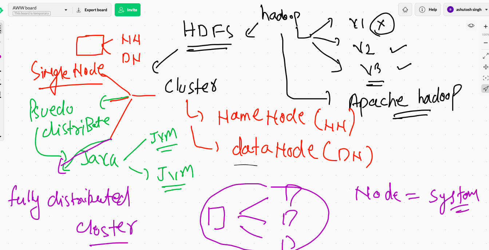
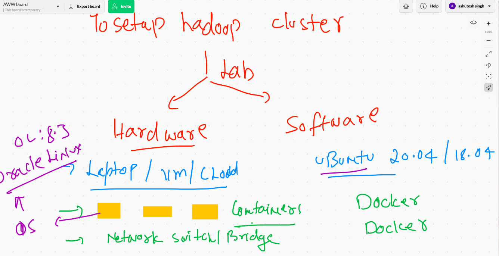
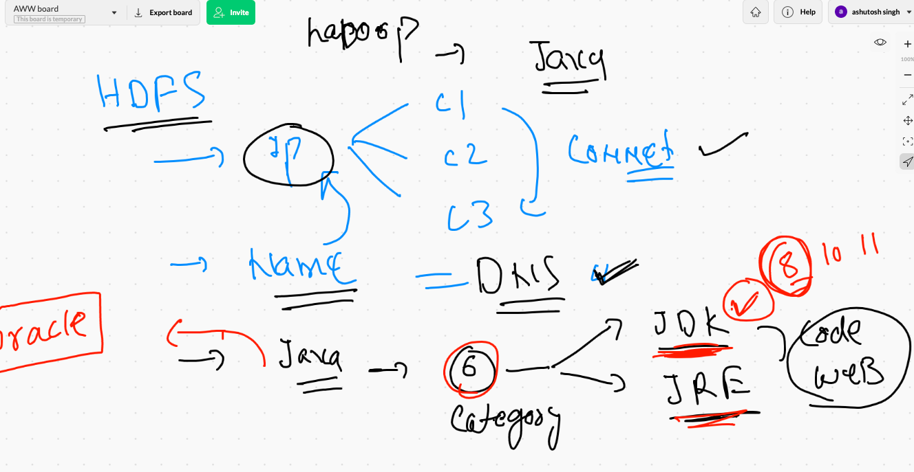

# data_engineering

## HDFS cluster info 


## type of HDFS cluster 



## lab setup details for HDFS cluster in apache hadoop 3.x



## We are using docker technology to setup lab 

### creating a network bridge / switch using docker 

```
fire@XIA:~$ docker  network create  myhadoop_br  --subnet  192.168.200.0/24  
c17628a535c2fa20f10976594f6197daeae6976fb7add068458421fb85109d7f
fire@XIA:~$ docker  network  ls
NETWORK ID     NAME                   DRIVER    SCOPE
43dea63f97b2   azure_devops_default   bridge    local
d26fc1330fd9   bigdata                bridge    local
0fed60f1ec71   bridge                 bridge    local
a196df1a4c70   host                   host      local
c17628a535c2   myhadoop_br            bridge    local
ba59d508192f   none                   null      local


```

### creating 3 containers 

```
1702  docker  run  -itd --name  namenode  --hostname namenode --network myhadoop_br --ip 192.168.200.100  oraclelinux:8.3  bash 
 1703  history 
 1704  docker  run  -itd --name  datanode1  --hostname datanode1 --network myhadoop_br  oraclelinux:8.3  bash 
 1705  docker  run  -itd --name  datanode2  --hostname datanode2 --network myhadoop_br  oraclelinux:8.3  bash 
 
```

### checking ip address based connection 

```
fire@XIA:~$ docker  exec  -it  datanode1  bash 
[root@datanode1 /]# ip a
1: lo: <LOOPBACK,UP,LOWER_UP> mtu 65536 qdisc noqueue state UNKNOWN group default qlen 1000
    link/loopback 00:00:00:00:00:00 brd 00:00:00:00:00:00
    inet 127.0.0.1/8 scope host lo
       valid_lft forever preferred_lft forever
38: eth0@if39: <BROADCAST,MULTICAST,UP,LOWER_UP> mtu 1500 qdisc noqueue state UP group default 
    link/ether 02:42:c0:a8:c8:02 brd ff:ff:ff:ff:ff:ff link-netnsid 0
    inet 192.168.200.2/24 brd 192.168.200.255 scope global eth0
       valid_lft forever preferred_lft forever
[root@datanode1 /]# 
[root@datanode1 /]# ping  192.168.200.100
PING 192.168.200.100 (192.168.200.100) 56(84) bytes of data.
64 bytes from 192.168.200.100: icmp_seq=1 ttl=64 time=0.193 ms
64 bytes from 192.168.200.100: icmp_seq=2 ttl=64 time=0.108 ms
64 bytes from 192.168.200.100: icmp_seq=3 ttl=64 time=0.111 ms
^C
--- 192.168.200.100 ping statistics ---
3 packets transmitted, 3 received, 0% packet loss, time 45ms
rtt min/avg/max/mdev = 0.108/0.137/0.193/0.040 ms
[root@datanode1 /]# exit
exit

```

### understanding more components requirement 



### jdk 8 installing 


### check steps to install jdk 

```
 dnf  install  java-1.8.0-openjdk.x86_64  java-1.8.0-openjdk-devel.x86_64 -y
 
```

### checking jdk version 

```
[root@namenode /]# java -version 
openjdk version "1.8.0_292"
OpenJDK Runtime Environment (build 1.8.0_292-b10)
OpenJDK 64-Bit Server VM (build 25.292-b10, mixed mode)

```

### setting up JAVA_HOME env in LInux PATH variable 

```
[root@namenode ~]# vi  .bashrc 
[root@namenode ~]# echo $PATH
/usr/local/sbin:/usr/local/bin:/usr/sbin:/usr/bin:/sbin:/bin
[root@namenode ~]# 
[root@namenode ~]# source  .bashrc 
[root@namenode ~]# 
[root@namenode ~]# echo $PATH
/usr/local/sbin:/usr/local/bin:/usr/sbin:/usr/bin:/sbin:/bin:/usr/lib/jvm/java-1.8.0-openjdk-1.8.0.292.b10-1.el8_4.x86_64/bin
[root@namenode ~]# 

```

### apache hadoop download link

[hadoopv3](https://www.apache.org/dyn/closer.cgi/hadoop/common)


