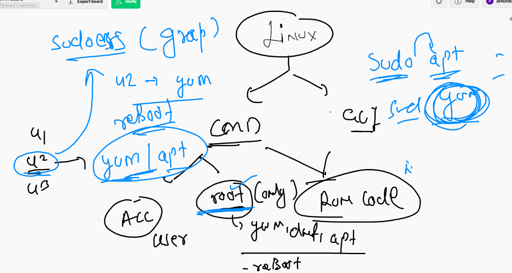
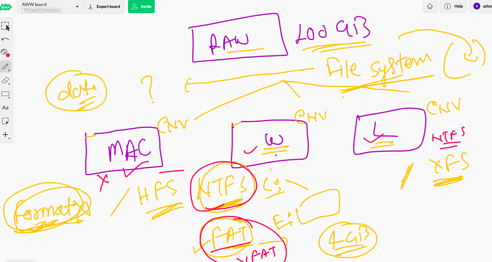

# data_engineering

## linux revision 

### IO redirection 

```
49  cal  >>mydata.txt 
   50  cat  mydata.txt 
   51  whoami >> mydata.txt 
   52  cat  mydata.txt 
   53  history 
   54  ksdjflsdf 
   55  ksdfjlsdfsd   >>mydata.txt 
   56  ksdfjlsdfsd   >error.txt 
   57  ls
   58  cat  error.txt 
   59  ksdfjlsdfsd   2>error.txt 
   60  cat  error.txt 
   61  date    2>error.txt 
   62  kkkk
   63  kkk    2>error.txt 
   64  cat  error.txt 
   65  kkk &>error.txt 
   66  date  &>error.txt 
   67  cat  error.txt 
   68  date  &>>error.txt 
   69  kkk  &>>error.txt 
   70  cat  error.txt 
   71  cal 
   72  cal   |   head  -2
   73  cal   |  tail   -2
   74  cal   |  tail  
   75  cal   |  head 
   76  history 
   77  echo hello 
   78  echo hello   |   tr  'a-z'  'A-Z'
   79  cat /etc/passwd
   80  cat /etc/passwd  |  tr 'a-z'  'A-Z'
   81  history 
   82  cat /etc/passwd  |  tr 'c-f'  'C-F'


```

## COncept of sudoers 



### checking Inode info about a file 

```
fire@XIA:~$ file  /etc/passwd
/etc/passwd: ASCII text
fire@XIA:~$ stat
stat       static-sh  
fire@XIA:~$ stat   /etc/passwd
  File: /etc/passwd
  Size: 3155      	Blocks: 8          IO Block: 4096   regular file
Device: 802h/2050d	Inode: 11548203    Links: 1
Access: (0644/-rw-r--r--)  Uid: (    0/    root)   Gid: (    0/    root)
Access: 2021-08-01 10:00:42.552227020 +0530
Modify: 2021-08-01 10:00:42.520227283 +0530
Change: 2021-08-01 10:00:42.520227283 +0530
 Birth: -
fire@XIA:~$ 
fire@XIA:~$ 
fire@XIA:~$ ls  -l  /etc/passwd
-rw-r--r-- 1 root root 3155 Aug  1 10:00 /etc/passwd
fire@XIA:~$ ls  -li   /etc/passwd
11548203 -rw-r--r-- 1 root root 3155 Aug  1 10:00 /etc/passwd


```

### Demo ACL 

```
root@XIA:~# vim /hello.txt
root@XIA:~# ls -l /hello.txt 
-rw-r--r-- 1 root root 10 Aug  1 10:11 /hello.txt
root@XIA:~# su - fire
fire@XIA:~$ vim /hello.txt 
fire@XIA:~$ 
fire@XIA:~$ 
fire@XIA:~$ logout
root@XIA:~# ls -l /hello.txt 
-rw-r--r-- 1 root root 10 Aug  1 10:11 /hello.txt
root@XIA:~# 
root@XIA:~# 
root@XIA:~# setfacl  -m  u:fire:rw-  /hello.txt 
root@XIA:~# su - fire
fire@XIA:~$ vim /hello.txt 
fire@XIA:~$ logout

```

## storage in any OS 



### checking hard disk / pd in any linux based OS 

```
[root@ip-172-31-22-53 ~]# lsblk 
NAME    MAJ:MIN RM  SIZE RO TYPE MOUNTPOINT
xvda    202:0    0   50G  0 disk 
└─xvda1 202:1    0   50G  0 part /
xvdf    202:80   0  100G  0 disk 
[root@ip-172-31-22-53 ~]# fdisk  -l
Disk /dev/xvda: 50 GiB, 53687091200 bytes, 104857600 sectors
Units: sectors of 1 * 512 = 512 bytes
Sector size (logical/physical): 512 bytes / 512 bytes
I/O size (minimum/optimal): 512 bytes / 512 bytes
Disklabel type: gpt
Disk identifier: C52DB3B7-097C-4067-908A-ED8095F37B2E

Device       Start       End   Sectors Size Type
/dev/xvda1    4096 104857566 104853471  50G Linux filesystem
/dev/xvda128  2048      4095      2048   1M BIOS boot

Partition table entries are not in disk order.


Disk /dev/xvdf: 100 GiB, 107374182400 bytes, 209715200 sectors
Units: sectors of 1 * 512 = 512 bytes
Sector size (logical/physical): 512 bytes / 512 bytes


```

### formating / making a filesystem of a storage 

```
[root@ip-172-31-22-53 ~]# mkfs.
mkfs.cramfs  mkfs.ext2    mkfs.ext3    mkfs.ext4    mkfs.fat     mkfs.minix   mkfs.msdos   mkfs.vfat    mkfs.xfs
[root@ip-172-31-22-53 ~]# mkfs.xfs   /dev/xvdf 
meta-data=/dev/xvdf              isize=512    agcount=4, agsize=6553600 blks
         =                       sectsz=512   attr=2, projid32bit=1
         =                       crc=1        finobt=1, sparse=0
data     =                       bsize=4096   blocks=26214400, imaxpct=25
         =                       sunit=0      swidth=0 blks
naming   =version 2              bsize=4096   ascii-ci=0 ftype=1
log      =internal log           bsize=4096   blocks=12800, version=2
         =                       sectsz=512   sunit=0 blks, lazy-count=1
realtime =none                   extsz=4096   blocks=0, rtextents=0


```

### mounting in linux and unmount also 

```
[root@ip-172-31-22-53 ~]# mount  /dev/xvdf     /mnt/ashu/
[root@ip-172-31-22-53 ~]# cd  /mnt/ashu/
[root@ip-172-31-22-53 ashu]# ls
[root@ip-172-31-22-53 ashu]# mkdir  hello guys 
[root@ip-172-31-22-53 ashu]# ls
guys  hello
[root@ip-172-31-22-53 ashu]# echo hlloo   >a.txt
[root@ip-172-31-22-53 ashu]# ls
a.txt  guys  hello
[root@ip-172-31-22-53 ashu]# cd
[root@ip-172-31-22-53 ~]# 
[root@ip-172-31-22-53 ~]# ls  /mnt/ashu/
a.txt  guys  hello
[root@ip-172-31-22-53 ~]# umount  /dev/xvdf  
[root@ip-172-31-22-53 ~]# cd  /mnt/ashu/
[root@ip-172-31-22-53 ashu]# ls
[root@ip-172-31-22-53 ashu]# cd
[root@ip-172-31-22-53 ~]# 
[root@ip-172-31-22-53 ~]# mkdir   /hii
[root@ip-172-31-22-53 ~]# mount  /dev/xvdf     /hii 
[root@ip-172-31-22-53 ~]# ls  /mnt/ashu/
[root@ip-172-31-22-53 ~]# ls  /hii
a.txt  guys  hello
[root@ip-172-31-22-53 ~]# 


```

### fstab in linux 

```
[root@ip-172-31-22-53 ~]# cat  /etc/fstab 
#

UUID=04b92f2f-4366-4687-868b-7c403cc59901     /           xfs    defaults,noatime  1   1
/dev/xvdf  /Cdrive/  xfs   defaults  0   0 

```

