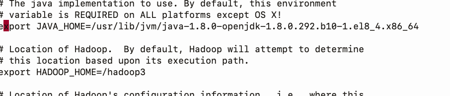

# data_engineering

##  few docker commands 

### to start stopped containers 

```
fire@XIA:~$ docker  start  namenode  datanode1  datanode2 
namenode
datanode1
datanode2
fire@XIA:~$ docker  ps
CONTAINER ID   IMAGE             COMMAND                  CREATED        STATUS         PORTS                                                 NAMES
e1189a8946e6   oraclelinux:8.3   "bash"                   24 hours ago   Up 2 seconds                                                         datanode2
75eef50f17c0   oraclelinux:8.3   "bash"                   24 hours ago   Up 2 seconds                                                         datanode1
e65560863784   oraclelinux:8.3   "bash"                   24 hours ago   Up 2 seconds  

```

##  restart policy --

```
fire@XIA:~$ docker   update  namenode  --restart  always 
namenode
fire@XIA:~$ docker   update datanode1  --restart  always 
datanode1
fire@XIA:~$ docker   update datanode2  --restart  always 

```

## login into namenode 

```
fire@XIA:~$ docker  exec  -ti  namenode  bash 
[root@namenode /]# 

```

### setting java_home path

```
[root@namenode ~]# cat .bashrc 
# .bashrc

# User specific aliases and functions

alias rm='rm -i'
alias cp='cp -i'
alias mv='mv -i'

# Source global definitions
if [ -f /etc/bashrc ]; then
	. /etc/bashrc
fi


JAVA_HOME=/usr/lib/jvm/java-1.8.0-openjdk-1.8.0.292.b10-1.el8_4.x86_64

PATH=$PATH:$JAVA_HOME/bin

export PATH

```

### hadoop link to download 

[apachehadoop3](https://downloads.apache.org/hadoop/common/stable/)

### Direct download link 

[Download](https://downloads.apache.org/hadoop/common/stable/hadoop-3.3.1.tar.gz)

## Please download hadoop 3 in Main Ubuntu machine  then transfer it to containers

```
fire@XIA:~/Desktop$ wget  https://downloads.apache.org/hadoop/common/stable/hadoop-3.3.1.tar.gz
--2021-07-03 07:38:21--  https://downloads.apache.org/hadoop/common/stable/hadoop-3.3.1.tar.gz
Resolving downloads.apache.org (downloads.apache.org)... 2a01:4f9:3a:2725::2, 2a01:4f8:10a:201a::2, 2a01:4f9:3a:2c57::2, ...
Connecting to downloads.apache.org (downloads.apache.org)|2a01:4f9:3a:2725::2|:443... connected.
HTTP request sent, awaiting response... 200 OK
Length: 605187279 (577M) [application/x-gzip]
Saving to: ‘hadoop-3.3.1.tar.gz’

hadoop-3.3.1.tar.gz             100%[=======================================================>] 577.15M  11.0MB/s    in 63s     

2021-07-03 07:39:25 (9.10 MB/s) - ‘hadoop-3.3.1.tar.gz’ saved [605187279/605187279]

fire@XIA:~/Desktop$ docker  cp   hadoop-3.3.1.tar.gz  namenode1:/
no such directory
fire@XIA:~/Desktop$ docker  cp   hadoop-3.3.1.tar.gz  namenode:/
fire@XIA:~/Desktop$ docker  cp   hadoop-3.3.1.tar.gz  datanode1:/
fire@XIA:~/Desktop$ docker  cp   hadoop-3.3.1.tar.gz  datanode2:/
fire@XIA:~/Desktop$ 


```

### decompress file 

```
 dnf install tar -y
   15  ls
   16  tar xvzf  hadoop-3.3.1.tar.gz 
   17  ls

```

### like java_home setting hadoop_home path as well

```
[root@namenode ~]# cat /root/.bashrc 
# .bashrc

# User specific aliases and functions

alias rm='rm -i'
alias cp='cp -i'
alias mv='mv -i'

# Source global definitions
if [ -f /etc/bashrc ]; then
	. /etc/bashrc
fi


JAVA_HOME=/usr/lib/jvm/java-1.8.0-openjdk-1.8.0.292.b10-1.el8_4.x86_64
HADOOP_HOME=/hadoop3

PATH=$PATH:$JAVA_HOME/bin:$HADOOP_HOME/bin:$HADOOP_HOME/sbin

export PATH

```

## all the nodes 

```
[root@namenode hadoop]# vi  hadoop-env.sh 
[root@namenode hadoop]# pwd
/hadoop3/etc/hadoop
[root@namenode hadoop]

```



### Name node configuration 

```
[root@namenode /]# cd /hadoop3/etc/hadoop/
[root@namenode hadoop]# ls
capacity-scheduler.xml      hadoop-user-functions.sh.example  kms-log4j.properties        ssl-client.xml.example
configuration.xsl           hdfs-rbf-site.xml                 kms-site.xml                ssl-server.xml.example
container-executor.cfg      hdfs-site.xml                     log4j.properties            user_ec_policies.xml.template
core-site.xml               httpfs-env.sh                     mapred-env.cmd              workers
hadoop-env.cmd              httpfs-log4j.properties           mapred-env.sh               yarn-env.cmd
hadoop-env.sh               httpfs-site.xml                   mapred-queues.xml.template  yarn-env.sh
hadoop-metrics2.properties  kms-acls.xml                      mapred-site.xml             yarn-site.xml
hadoop-policy.xml           kms-env.sh                        shellprofile.d              yarnservice-log4j.properties

```

### hadoop-env.sh 

```

export java_home=javapath
export home=/hadoop3

```

### core-site.xml 

```
<configuration>
<property>
	<name>fs.default.name</name>
	<value>hdfs://namenode:9000</value>
</property>

</configuration>
```

### hdfs-site.xml 

```
<configuration>
<property>
	<name>dfs.namenode.name.dir</name>
	<value>/mynndata</value>
	<description>location where namenode will store its metadata </description>
</property>

<property>
	<name>dfs.replication</name>
	<value>3</value>
	<description> number of copy for each block or chunk </description>
</property>
</configuration>
```


### Datanode 

### hadoop-env.sh will be same as Namenode
### core-site.xml will be same as namenode

### hdfs-site.xml 

```
<configuration>

<property>
	<name>dfs.datanode.data.dir</name>
	<value>/mydndata1</value>
	<description>location where datanode will store its data</description>
</property>
</configuration>
```


