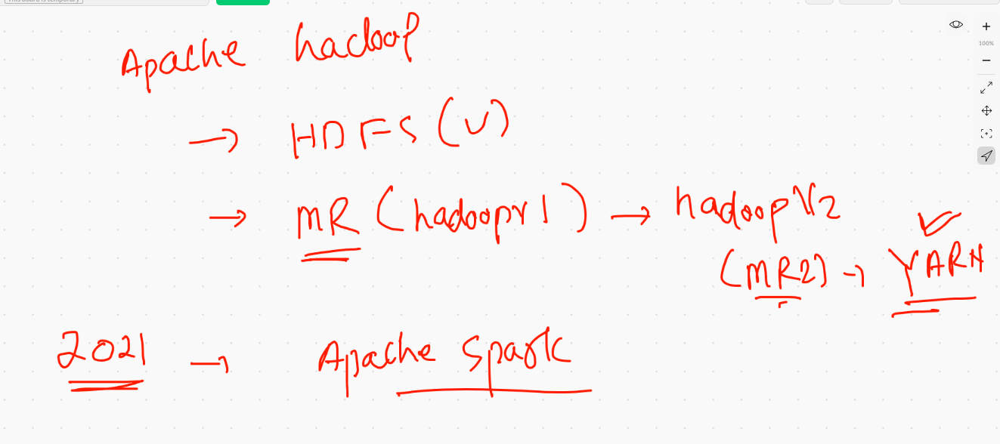

# data_engineering

## HDFS storage union mounting 


### checking cluster status 

```
[root@namenode /]# hdfs  dfsadmin  -report 
Configured Capacity: 468414390272 (436.24 GB)
Present Capacity: 139771064320 (130.17 GB)
DFS Remaining: 139771006976 (130.17 GB)
DFS Used: 57344 (56 KB)
DFS Used%: 0.00%
Replicated Blocks:
	Under replicated blocks: 0
	Blocks with corrupt replicas: 0
	Missing blocks: 0
	Missing blocks (with replication factor 1): 0
	Low redundancy blocks with highest priority to recover: 0
	Pending deletion blocks: 0
Erasure Coded Block Groups: 

```

### creating directories in hdfs

```
[root@namenode /]# hdfs  dfs -mkdir  /ashu              
[root@namenode /]# hdfs  dfs -mkdir  /ashu/data
[root@namenode /]# hdfs  dfs -mkdir  /ashu/data/txtdata
[root@namenode /]# hdfs  dfs   -ls -R  /
drwxr-xr-x   - root supergroup          0 2021-07-06 01:59 /LnB
drwxr-xr-x   - root supergroup          0 2021-07-06 01:59 /LnB/data-engg
drwxr-xr-x   - root supergroup          0 2021-07-06 02:00 /ashu
drwxr-xr-x   - root supergroup          0 2021-07-06 02:01 /ashu/data
drwxr-xr-x   - root supergroup          0 2021-07-06 02:01 /ashu/data/txtdata
drwxr-xr-x   - root supergroup          0 2021-07-06 01:58 /hadoopclass

```

### uploading data from local to HDFS 

```
[root@namenode /]# hdfs  dfs -copyFromLocal  /tmp/data.txt  /LnB/data-engg/
[root@namenode /]# bc
bash: bc: command not found
[root@namenode /]# hdfs  dfs -ls -R /LnB
drwxr-xr-x   - root supergroup          0 2021-07-06 02:09 /LnB/data-engg
-rw-r--r--   3 root supergroup  673142184 2021-07-06 02:09 /LnB/data-engg/data.txt

```

### adding more data node on real 

```
1845  docker  commit -m  "datanode sample"   datanode1   hadoop:vv3 
 1846  docker images
 1847  docker rmi 7d0742cdea0b 
 1848  docker images
 1849  docker network ls
 1850  history 
 1851  docker  run  -itd --name  datanode3  --hostname datanode3 --network myhadoop_br  hadoop:vv3  
 1852  docker  run  -itd --name  datanode4  --hostname datanode4 --network myhadoop_br  hadoop:vv3  
 1853  docker  run  -itd --name  datanode5  --hostname datanode5 --network myhadoop_br  hadoop:vv3  
 1854  docker  run  -itd --name  datanode6  --hostname datanode6 --network myhadoop_br  hadoop:vv3 
 
```

### apache hadoop view 



