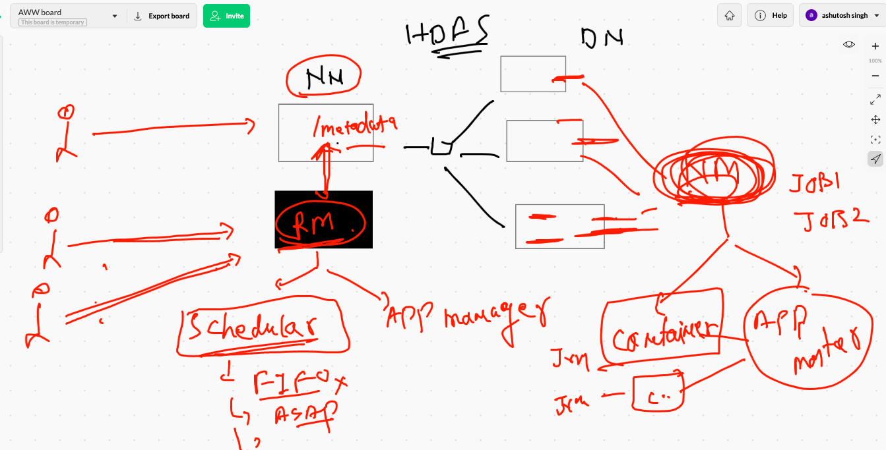

# data_engineering

## YARN -- Yet another resource negotiator 



## file configuration for Resource manager 

### 

```
[root@namenode hadoop]# cat  mapred-site.xml 
<?xml version="1.0"?>
<?xml-stylesheet type="text/xsl" href="configuration.xsl"?>

<configuration>
<property>
	<name>mapreduce.framework.name</name>
	<value>yarn</value>
</property>
</configuration>

```

### 

```
[root@namenode hadoop]# cat  yarn-site.xml 
<?xml version="1.0"?>
<configuration>
<property>
	<name>yarn.resourcemanager.address</name>
	<value>namenode:8032</value>
</property>

<property>
	<name>yarn.resourcemanager.schedular.address</name>
	<value>namenode:8030</value>
</property>

<property>
	<name>yarn.resourcemanager.resource-tracker.address</name>
	<value>namenode:8025</value>
</property>
</configuration>


```

## starting RM 

```

 206  yarn-daemon.sh  start  resourcemanager
  207  jps
  208  yarn --daemon stop  resourcemanager
  209  yarn --daemon start  resourcemanager
  
 ```
 
 ## Understanding JAr file operations from RM 
 
 ```
 [root@namenode mapreduce]# pwd
/hadoop3/share/hadoop/mapreduce
[root@namenode mapreduce]# ls
hadoop-mapreduce-client-app-3.3.1.jar              hadoop-mapreduce-client-nativetask-3.3.1.jar
hadoop-mapreduce-client-common-3.3.1.jar           hadoop-mapreduce-client-shuffle-3.3.1.jar
hadoop-mapreduce-client-core-3.3.1.jar             hadoop-mapreduce-client-uploader-3.3.1.jar
hadoop-mapreduce-client-hs-3.3.1.jar               hadoop-mapreduce-examples-3.3.1.jar
hadoop-mapreduce-client-hs-plugins-3.3.1.jar       jdiff
hadoop-mapreduce-client-jobclient-3.3.1-tests.jar  lib-examples
hadoop-mapreduce-client-jobclient-3.3.1.jar        sources
[root@namenode mapreduce]# 
[root@namenode mapreduce]# yarn  jar  hadoop-mapreduce-examples-3.3.1.jar   


```

