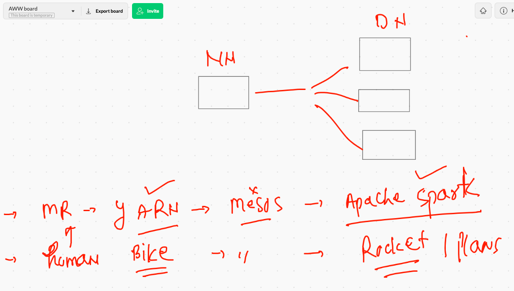

# data_engineering

##  HDFS basic command 

```
[ashu@namenode ~]$ history 
    1  hdfs 
    2  ls
    3  cat .bashrc 
    4  vi .bashrc 
    5  source  .bashrc 
    6  hdfs
    7  hdfs  dfs  -ls  /
    8  hdfs  dfs  -mkdir   /me
    9  hdfs  dfs  -ls -R  /
   10  hdfs  dfs  -mkdir   /ashu/data/try
   11  hdfs  dfs  -ls -R  /ashu/data
   12  hdfs  dfs  -rm   /ashu/data/txtdata
   13  hdfs  dfs  -rmr   /ashu/data/txtdata
   14  hdfs  dfs  -rm -r   /ashu/data/txtdata
   15  hdfs  dfs  -ls -R  /ashu/data
   16  wget https://www.stats.govt.nz/assets/Uploads/Annual-enterprise-survey/Annual-enterprise-survey-2020-financial-year-provisional/Download-data/annual-enterprise-survey-2020-financial-year-provisional-csv.csv
   17  ls
   18  mv  annual-enterprise-survey-2020-financial-year-provisional-csv.csv  fin.csv
   19  cat  fin.csv 
   20  s
   21  ls
   22  hdfs  dfs -ls /ashu/data
   23  hdfs  dfs -put  fin.csv  /ashu/data
   24  hdfs  dfs -ls /ashu/data
   25  hdfs  dfs -cat /ashu/data/fin.csv
   
```

## data processing frameworks 



