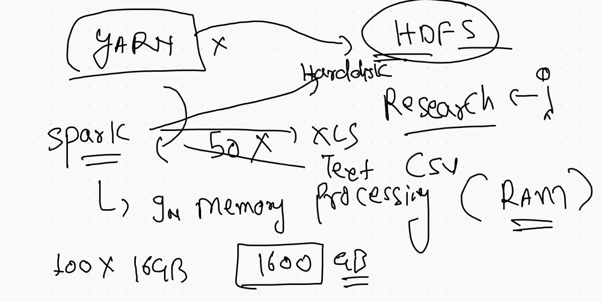
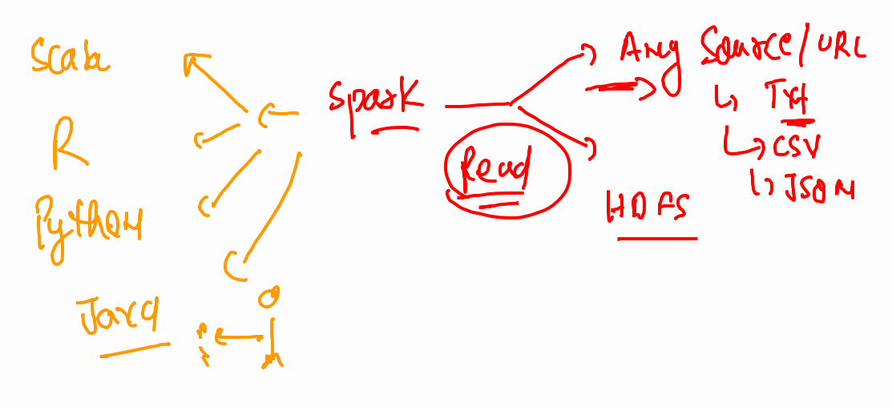

# data_engineering

## spark 



## creating spark instance 

```
docker  run -itd  --name sparkmaster --hostname sparkM  --network myhadoop_br  -p 9898:8080 --restart  always  dockerashu/spark:v1   bash 

```

## starting working in the same container 

```
fire@XIA:~$ docker exec -it sparkmaster  bash 
root@sparkM:/# jps
25 Jps
root@sparkM:/# start-master.sh  
starting org.apache.spark.deploy.master.Master, logging to /opt/spark/logs/spark--org.apache.spark.deploy.master.Master-1-sparkM.out
root@sparkM:/# jps
115 Jps
52 Master
root@sparkM:/# hostname 
sparkM
root@sparkM:/# start-worker.sh  spark://sparkM:7077 
starting org.apache.spark.deploy.worker.Worker, logging to /opt/spark/logs/spark--org.apache.spark.deploy.worker.Worker-1-sparkM.out
root@sparkM:/# jps
209 Jps
52 Master
140 Worker

```

## spark connecting options 



### starting scala interface to code 

```
root@sparkM:/# spark-shell 
WARNING: An illegal reflective access operation has occurred
WARNING: Illegal reflective access by org.apache.spark.unsafe.Platform (file:/opt/spark/jars/spark-unsafe_2.12-3.1.2.jar) to constructor java.nio.DirectByteBuffer(long,int)
WARNING: Please consider reporting this to the maintainers of org.apache.spark.unsafe.Platform
WARNING: Use --illegal-access=warn to enable warnings of further illegal reflective access operations
WARNING: All illegal access operations will be denied in a future release
21/07/16 08:05:56 WARN NativeCodeLoader: Unable to load native-hadoop library for your platform... using builtin-java classes where applicable
Using Spark's default log4j profile: org/apache/spark/log4j-defaults.properties
Setting default log level to "WARN".
To adjust logging level use sc.setLogLevel(newLevel). For SparkR, use setLogLevel(newLevel).
Spark context Web UI available at http://sparkM:4040
Spark context available as 'sc' (master = local[*], app id = local-1626402961528).
Spark session available as 'spark'.
Welcome to
      ____              __
     / __/__  ___ _____/ /__
    _\ \/ _ \/ _ `/ __/  '_/
   /___/ .__/\_,_/_/ /_/\_\   version 3.1.2
      /_/
         
Using Scala version 2.12.10 (OpenJDK 64-Bit Server VM, Java 11.0.11)
Type in expressions to have them evaluated.
Type :help for more information.

scala> 

```

### python interface for apache spark 

```
root@sparkM:/# pyspark 
Python 3.8.10 (default, Jun  2 2021, 10:49:15) 
[GCC 9.4.0] on linux
Type "help", "copyright", "credits" or "license" for more information.
WARNING: An illegal reflective access operation has occurred
WARNING: Illegal reflective access by org.apache.spark.unsafe.Platform (file:/opt/spark/jars/spark-unsafe_2.12-3.1.2.jar) to constructor java.nio.DirectByteBuffer(long,int)
WARNING: Please consider reporting this to the maintainers of org.apache.spark.unsafe.Platform
WARNING: Use --illegal-access=warn to enable warnings of further illegal reflective access operations
WARNING: All illegal access operations will be denied in a future release
21/07/16 08:06:46 WARN NativeCodeLoader: Unable to load native-hadoop library for your platform... using builtin-java classes where applicable
Using Spark's default log4j profile: org/apache/spark/log4j-defaults.properties
Setting default log level to "WARN".
To adjust logging level use sc.setLogLevel(newLevel). For SparkR, use setLogLevel(newLevel).
Welcome to
      ____              __
     / __/__  ___ _____/ /__
    _\ \/ _ \/ _ `/ __/  '_/
   /__ / .__/\_,_/_/ /_/\_\   version 3.1.2
      /_/

Using Python version 3.8.10 (default, Jun  2 2021 10:49:15)
Spark context Web UI available at http://sparkM:4040
Spark context available as 'sc' (master = local[*], app id = local-1626403007492).
SparkSession available as 'spark'.
>>> 
```

## methods for creating rdd


