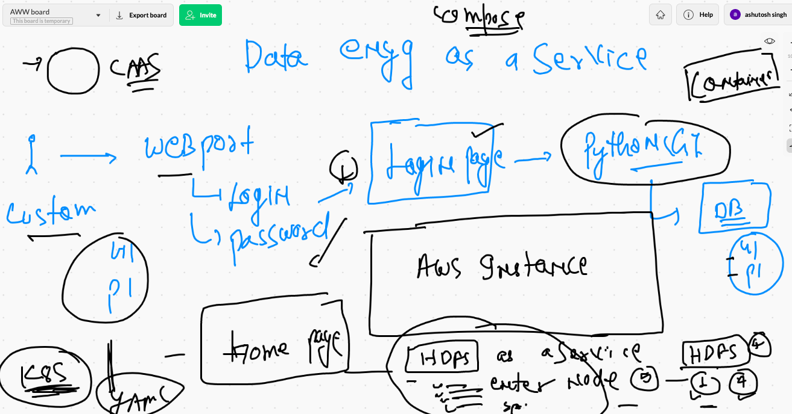
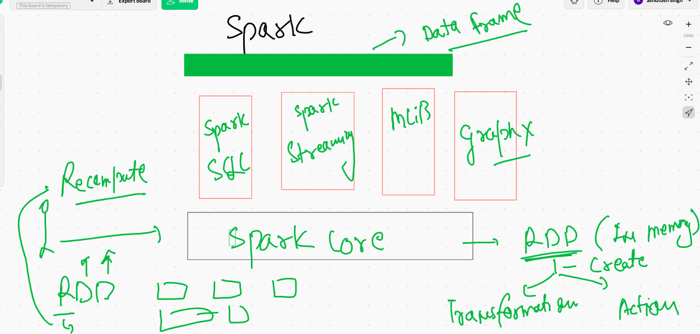
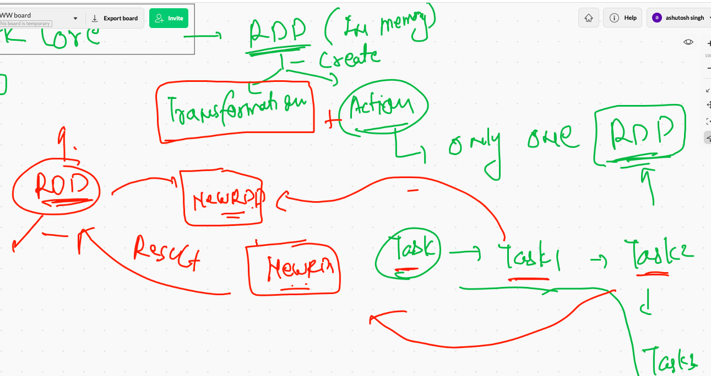

# data_engineering

## project 



## apache spark  understanding as a framework 



## apache RDD methods 



## reading data from a text file 

```
>>> firstRDD=sc.textFile('/tmp/data.txt')
Traceback (most recent call last):
  File "/opt/spark/python/pyspark/context.py", line 285, in signal_handler
    raise KeyboardInterrupt()
KeyboardInterrupt
>>> firstRDD.first()
'hello world this is me'                                                        
>>> firstRDD.take(5)
['hello world this is me', 'container is awesome ', 'docker is CRE', 'you guys are amazing ', 'hello world this is me']
>>> [i for i in firstRDD.take(5)]
['hello world this is me', 'container is awesome ', 'docker is CRE', 'you guys are amazing ', 'hello world this is me']
>>> for i in firstRDD.take(5):
...     print(i)
... 
hello world this is me
container is awesome 
docker is CRE
you guys are amazing 
hello world this is me

```

### first python code for spark 

```
root@sparkM:~# cat spark_task1.py 
#!/usr/bin/python3

from pyspark import SparkContext

# connecting sparkcontext with spark master ..

sc=SparkContext("local","app_first")
# now sc is same as pyspark sc
#firtRDD=sc.textFile('/tmp/data.txt')
# second method creating data inside python only 
data1=["hello","this","is","python","power"]
# loading data from a list

transform1=sc.parallelize(data1)
# now we can do some action 

action1=transform1.count()

#printing
print("Number of RDD element ",action1)


```

