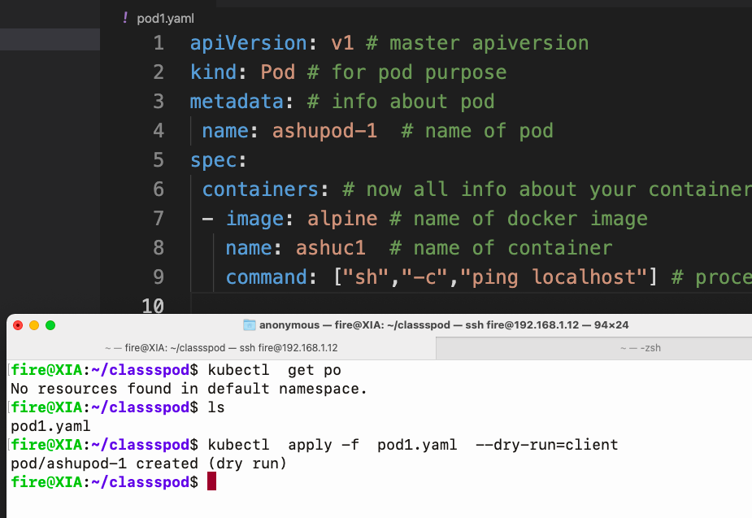

# data_engineering

## writing yaml for pod creation 




## checking syntax of yaml pod

```
fire@XIA:~/classspod$ kubectl  apply -f  pod1.yaml  --dry-run=client 
pod/ashupod-1 created (dry run)

```

## deploy pod 

```
fire@XIA:~/classspod$ kubectl  apply -f  pod1.yaml 
pod/ashupod-1 created
fire@XIA:~/classspod$ kubectl   get  pods
NAME        READY   STATUS    RESTARTS   AGE
ashupod-1   1/1     Running   0          67s
fire@XIA:~/classspod$ kubectl  get  no

```

### delete all pods 

```
 kubectl delete pods --all
pod "ashujavapod1" deleted
pod "ashupod-1" deleted
pod "bpod2" deleted
pod "jeypod1" deleted
pod "jeywebpod1" deleted
pod "jitendrapod1" deleted
pod "krispod1" deleted
pod "nishpod1" deleted
pod "palashpod1" deleted
pod "rashmijavapod1" deleted
pod "shyspod1" deleted


```

### checking output of pod 

```
kubectl   get  pods
 2021  kubectl   logs -f  ashupod-1
 
```

### DOcker image build 

```
2041  docker  run -tid --name xx33  pythonapp:v1 
 2042  docker  logs -f  xx33
 2043  docker  rm  xx33 -f
 2044  history 
fire@XIA:~/classspod/classpod$ docker  tag  pythonapp:v1  dockerashu/pythonapp:v1
fire@XIA:~/classspod/classpod$ docker login -u dockerashu
Password: 
WARNING! Your password will be stored unencrypted in /home/fire/.docker/config.json.
Configure a credential helper to remove this warning. See
https://docs.docker.com/engine/reference/commandline/login/#credentials-store

Login Succeeded
fire@XIA:~/classspod/classpod$ docker push dockerashu/pythonapp:v1
The push refers to repository [docker.io/dockerashu/pythonapp]
f5fa41685368: Pushed 
ab89c2c9ed36: Pushed 
fd3cbf7a4598: Pushed 
0887300850ce: Pushed 
2f140462f3bc: Mounted from dockerashu/spark 
63c99163f472: Mounted from dockerashu/spark 
ccdbb80308cc: Mounted from dockerashu/spark 
v1: digest: sha256:1d60d9518992fef621bf4d0712417875575e6f06961c13e0638d8066abdbf111 size: 1781
fire@XIA:~/classspod/classpod$ 

```

### yaml generate 

```
fire@XIA:~/classspod$ kubectl   run  ashupypod1  --image=dockerashu/pythonapp:v1 --dry-run=client  -o yaml
apiVersion: v1
kind: Pod
metadata:
  creationTimestamp: null
  labels:
    run: ashupypod1
  name: ashupypod1
spec:
  containers:
  - image: dockerashu/pythonapp:v1
    name: ashupypod1
    resources: {}
  dnsPolicy: ClusterFirst
  restartPolicy: Always
status: {}


```

### more pod commands

```
2050  kubectl   run  ashupypod1  --image=dockerashu/pythonapp:v1 --dry-run=client 
 2051  kubectl   run  ashupypod1  --image=dockerashu/pythonapp:v1 --dry-run=client  -o yaml
 2052  kubectl   run  ashupypod1  --image=dockerashu/pythonapp:v1 --dry-run=client  -o json 
 2053  kubectl   run  ashupypod1  --image=dockerashu/pythonapp:v1 --dry-run=client  -o json   >hello.json 
 2054  kubectl   get  po 
 2055  kubectl   run  ashupypod1  --image=dockerashu/pythonapp:v1 


```

### accessing a container inside pod 
```
fire@XIA:~/classspod$ kubectl   exec -it  ashupypod1  -- bash
root@ashupypod1:/# 
root@ashupypod1:/# 
root@ashupypod1:/# cat /etc/os-release 
NAME="Ubuntu"
VERSION="20.04.2 LTS (Focal Fossa)"
ID=ubuntu
ID_LIKE=debian
PRETTY_NAME="Ubuntu 20.04.2 LTS"
VERSION_ID="20.04"
HOME_URL="https://www.ubuntu.com/"
SUPPORT_URL="https://help.ubuntu.com/"
BUG_REPORT_URL="https://bugs.launchpad.net/ubuntu/"
PRIVACY_POLICY_URL="https://www.ubuntu.com/legal/terms-and-policies/privacy-policy"
VERSION_CODENAME=focal
UBUNTU_CODENAME=focal
root@ashupypod1:/# ls
bin  boot  dev  etc  home  lib  lib32  lib64  libx32  media  mnt  mycode  opt  proc  root  run  sbin  srv  sys  tmp  usr  var
root@ashupypod1:/# cd  mycode/
root@ashupypod1:/mycode# ls
hello.py
root@ashupypod1:/mycode# exit
exit


```

###  pod describe 


```
fire@XIA:~/classspod$ kubectl   describe pod  ashupypod1 
Name:         ashupypod1
Namespace:    default
Priority:     0
Node:         minikube/192.168.49.2
Start Time:   Thu, 29 Jul 2021 08:19:40 +0530
Labels:       run=ashupypod1
Annotations:  <none>
Status:       Running
IP:           172.17.0.3
IPs:
  IP:  172.17.0.3
Containers:
  ashupypod1:
    Container ID:   docker://5e9c976fbc3a86a8c569287d8a927681be73d1b117a0064e7bf832b267bd5ca9
    Image:          dockerashu/pythonapp:v1
    Image ID:       docker-pullable://dockerashu/pythonapp@sha256:1d60d9518992fef621bf4d0712417875575e6f06961c13e0638d8066abdbf111
    Port:           <none>
    Host Port:      <none>
    State:          Running
      Started:      Thu, 29 Jul 2021 08:19:41 +0530
    Ready:          True

```

### Minikube pod URL 

```
fire@XIA:~/classspod/webapp$ kubectl   get  no
NAME       STATUS   ROLES                  AGE   VERSION
minikube   Ready    control-plane,master   64m   v1.20.2
fire@XIA:~/classspod/webapp$ kubectl   get po 
NAME         READY   STATUS    RESTARTS   AGE
ashupypod1   1/1     Running   0          16m
webapp       1/1     Running   0          4m32s
fire@XIA:~/classspod/webapp$ kubectl  expose  pod webapp  --type NodePort --port 80 
service/webapp exposed
fire@XIA:~/classspod/webapp$ kubectl  get  service 
NAME         TYPE        CLUSTER-IP     EXTERNAL-IP   PORT(S)        AGE
kubernetes   ClusterIP   10.96.0.1      <none>        443/TCP        51m
webapp       NodePort    10.101.59.83   <none>        80:32078/TCP   5s
fire@XIA:~/classspod/webapp$ minikube  service --url  webapp 
http://192.168.49.2:32078
fire@XIA:~/classspod/webapp$ 


```


