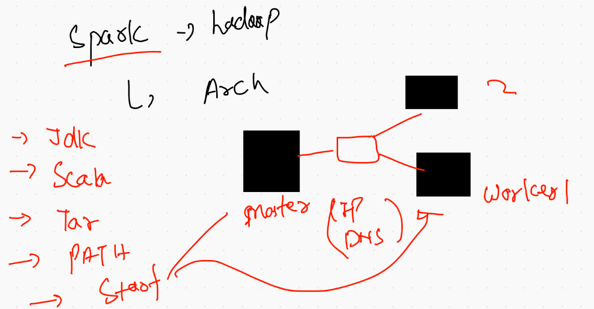

# data_engineering

## Bingo Welcome to apache spark 


## little things you need to know 



## creating a common docker image for spark packages 

```
docker run -it  --name spark_common  ubuntu bash
```

## installing and setup all pre-requisite software related to spark 

```
apt update
apt  install  default-jdk  git  scala -y 
 java -version ; javac -version ; scala -version ; git --version 
  apt install wget -y
  wget  https://downloads.apache.org/spark/spark-3.1.2/spark-3.1.2-bin-hadoop3.2.tgz
 tar xvzf  spark-3.1.2-bin-hadoop3.2.tgz 
  rm  spark-3.1.2-bin-hadoop3.2.tgz 
   mv  spark-3.1.2-bin-hadoop3.2/  /opt/spark 
   apt install vim -y
   apt install python3 -y
    apt install net-tools -y
    

```

### setting /root/.bashrc file 
### Note : in very last line  add this data 
```
export SPARK_HOME=/opt/spark
export PATH=$PATH:$SPARK_HOME/bin:$SPARK_HOME/sbin
export PYSPARK_PYTHON=/usr/bin/python3
```
## creating docker image from a running or non running container 

```
 docker  commit  -m  "spark common image"   spark_common   spark:v1 
```


## If you don't wanna setup your common image then..

### PLZ use mine 

## uploading image on docker hUB --- that is image registry 

```
fire@XIA:~$ docker  tag   spark:v1   dockerashu/spark:v1 
fire@XIA:~$ docker login -u  dockerashu 
Password: 
WARNING! Your password will be stored unencrypted in /home/fire/.docker/config.json.
Configure a credential helper to remove this warning. See
https://docs.docker.com/engine/reference/commandline/login/#credentials-store

Login Succeeded
fire@XIA:~$ docker push dockerashu/spark:v1 
The push refers to repository [docker.io/dockerashu/spark]
482aeb38981e: Pushing  313.5MB/1.13GB
2f140462f3bc: Mounted from library/ubuntu 
63c99163f472: Mounted from library/ubuntu 
ccdbb80308cc: Mounted

```

## whosoever wanna use that just chill

```
docker pull dockerashu/spark:v1
```

