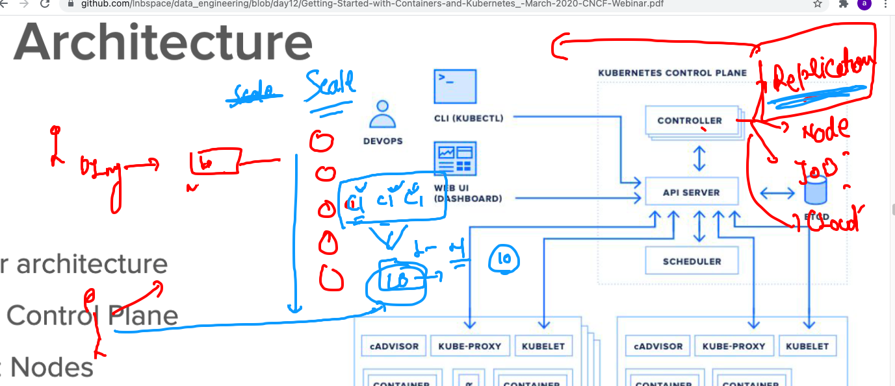

# data_engineering

## k8s arch level 2 


## Replication controller 



## ETCD 


## k8s installation methods 


## Minikube installation 

[Install_link](https://minikube.sigs.k8s.io/docs/start/)

## Minikube version check 

```
fire@XIA:~$ minikube  version 
minikube version: v1.20.0
commit: c61663e942ec43b20e8e70839dcca52e44cd85ae

```

## creating laptop version of k8s cluster 

```
fire@XIA:~$ minikube  start --driver=docker 
😄  minikube v1.20.0 on Ubuntu 20.04
✨  Using the docker driver based on user configuration
🎉  minikube 1.22.0 is available! Download it: https://github.com/kubernetes/minikube/releases/tag/v1.22.0
💡  To disable this notice, run: 'minikube config set WantUpdateNotification false'

👍  Starting control plane node minikube in cluster minikube
🚜  Pulling base image ...
    > gcr.io/k8s-minikube/kicbase...: 358.10 MiB / 358.10 MiB  100.00% 4.99 MiB
    > gcr.io/k8s-minikube/kicbase...: 358.10 MiB / 358.10 MiB  100.00% 6.22 MiB
🔥  Creating docker container (CPUs=2, Memory=7900MB) ...
🐳  Preparing Kubernetes v1.20.2 on Docker 20.10.6 ...
    ▪ Generating certificates and keys ...
    ▪ Booting up control plane ...
    ▪ Configuring RBAC rules ...
🔎  Verifying Kubernetes components...
    ▪ Using image gcr.io/k8s-minikube/storage-provisioner:v5
🌟  Enabled addons: storage-provisioner, default-storageclass
🏄  Done! kubectl is now configured to use "minikube" cluster and "default" names
```

## to connect kubernetes cluster we need kubectl client 


[install](https://kubernetes.io/docs/tasks/tools/install-kubectl-linux/)

## kubectl check 

```
fire@XIA:~$ kubectl   version --client 
Client Version: version.Info{Major:"1", Minor:"21", GitVersion:"v1.21.0", GitCommit:"cb303e613a121a29364f75cc67d3d580833a7479", GitTreeState:"clean", BuildDate:"2021-04-08T16:31:21Z", GoVersion:"go1.16.1", Compiler:"gc", Platform:"linux/amd64"}

```

## checking number of nodes

```
fire@XIA:~$ kubectl   get  nodes 
NAME       STATUS   ROLES                  AGE     VERSION
minikube   Ready    control-plane,master   3m24s   v1.20.2
fire@XIA:~$ 


```

