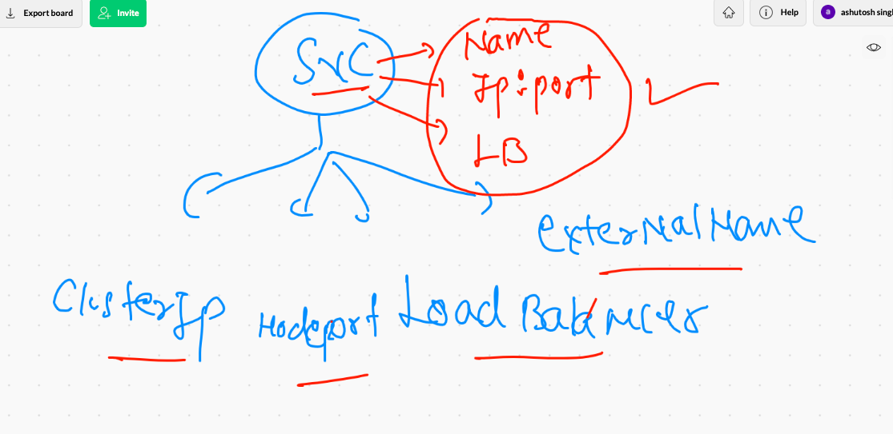

# data_engineering

## devops workflow 


## deploy pod and access from k8s client machine 

```
anonymous@ashutoshhs-MacBook-Air ~ % kubectl  run webapppod  --image=dockerashu/nginxapp:v1  --port 80
pod/webapppod created
anonymous@ashutoshhs-MacBook-Air ~ % kubectl get po 
NAME        READY   STATUS              RESTARTS   AGE
webapppod   0/1     ContainerCreating   0          4s
anonymous@ashutoshhs-MacBook-Air ~ % kubectl get po 
NAME        READY   STATUS              RESTARTS   AGE
webapppod   0/1     ContainerCreating   0          9s
anonymous@ashutoshhs-MacBook-Air ~ % kubectl get po 
NAME        READY   STATUS    RESTARTS   AGE
webapppod   1/1     Running   0          11s
anonymous@ashutoshhs-MacBook-Air ~ % kubectl get po -o wide
NAME        READY   STATUS    RESTARTS   AGE   IP              NODE      NOMINATED NODE   READINESS GATES
webapppod   1/1     Running   0          14s   192.168.34.25   minion1   <none>           <none>
anonymous@ashutoshhs-MacBook-Air ~ % kubectl   port-forward   webapppod   1234:80 
Forwarding from 127.0.0.1:1234 -> 80
Forwarding from [::1]:1234 -> 80
Handling connection for 1234
Handling connection for 1234
^C%                               

```

## Introduction to service in k8s 


## svc use label/tag. to find pod then forward traffic 


## service type in k8s



## Nodeport service explaination 


## service 

```
anonymous@ashutoshhs-MacBook-Air ~ % vim s.yml 
anonymous@ashutoshhs-MacBook-Air ~ % kubectl apply -f  s.yml 
service/ashusvc1 configured
anonymous@ashutoshhs-MacBook-Air ~ % cat  s.yml 
apiVersion: v1
kind: Service
metadata:
  creationTimestamp: null
  labels:
    app: ashusvc1
  name: ashusvc1
spec:
  ports:
  - name: 1234-80
    port: 1234
    protocol: TCP
    targetPort: 80
  selector: # you are pod finder  using label of pod 
    run: webapppod
  type: NodePort
status:
  loadBalancer: {}
anonymous@ashutoshhs-MacBook-Air ~ % kubectl get  po --show-labels -o wide                                                 
NAME        READY   STATUS    RESTARTS   AGE     IP              NODE      NOMINATED NODE   READINESS GATES   LABELS
hellopod    1/1     Running   0          5m32s   192.168.34.53   minion1   <none>           <none>            run=hellopod
webapppod   1/1     Running   0          44m     192.168.34.25   minion1   <none>           <none>            run=webapppo

```

